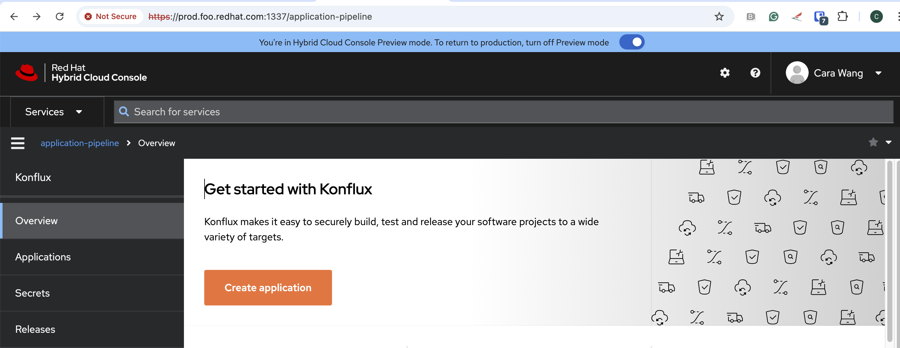

# HAC Developer Experience

React.js application for HAC Developer Experience built using Patternfly 4 and shared Red Hat cloud service frontend components. This application integrates into cloud.redhat.com using Webpack 5 module federation.

HAC Developer Experience will deliver the UI for App Studio.

## Getting started

### Run with webpack proxy

1. ```yarn install```

    For this step, I enjoyed the ```brew install yarn``` and then I got the '1.22.22' yarn installed and worked.
    When i tried the ```yarn install --verbose```, i can see there was a hang.
    After I removed ```.config/.../yarn.lock```, things were resolved.

2. Start webpack - ```ENVIRONMENT=prod yarn dev```

    You will get the output like:

    ```log
    <i> [webpack-dev-server] Project is running at:
    <i> [webpack-dev-server] Loopback: https://localhost:1337/
    <i> [webpack-dev-server] On Your Network (IPv4): https://192.168.1.2:1337/
    <i> [webpack-dev-server] On Your Network (IPv6): https://[fe80::1]:1337/
    <i> [webpack-dev-server] Content not from webpack is served from '/Users/carawang/hac-dev/dist' directory
    <i> [webpack-dev-server] 404s will fallback to '/index.html'
    App should run on:

    - https://prod.foo.redhat.com:1337/application-pipeline

    Static assets are available at:

    - https://prod.foo.redhat.com:1337/api/plugins/hac-dev/
    ```

3. Update `/etc/hosts` to make sure the prod.foo.redhat.com points to 127.0.0.1

    You need to append this to your `/etc/hosts` for auth:

    ```bash
    127.0.0.1 prod.foo.redhat.com
    127.0.0.1 stage.foo.redhat.com
    127.0.0.1 qa.foo.redhat.com
    127.0.0.1 ci.foo.redhat.com
    ```

    Then refresh your network:

    ```bash
    sudo dscacheutil -flushcache
    sudo killall -HUP mDNSResponder
    ```

    And ping the ```prod.foo.redhat.com``` to make sure it points to ```127.0.0.1```.
    Finally, open your browser and visit the ```https://prod.foo.redhat.com:1337/application-pipeline```.
    

### Testing

`yarn verify` will run `yarn lint` (eslint) and `npm test` (Jest). To generate contracts using Pact, run `yarn pact` command. Read more about Pact contract tests [here](pactTests.md).


## Contributing
We encourage public contributions! Please review [CONTRIBUTING.md](docs/CONTRIBUTING.md) for details on our code of conduct and development process.

## Further Reading
- **[ARCHITECTURE](docs/ARCHITECTURE.md)**
- **[STYLEGUIDE](docs/STYLEGUIDE.md)**
- **[OWNERS](OWNERS)**


